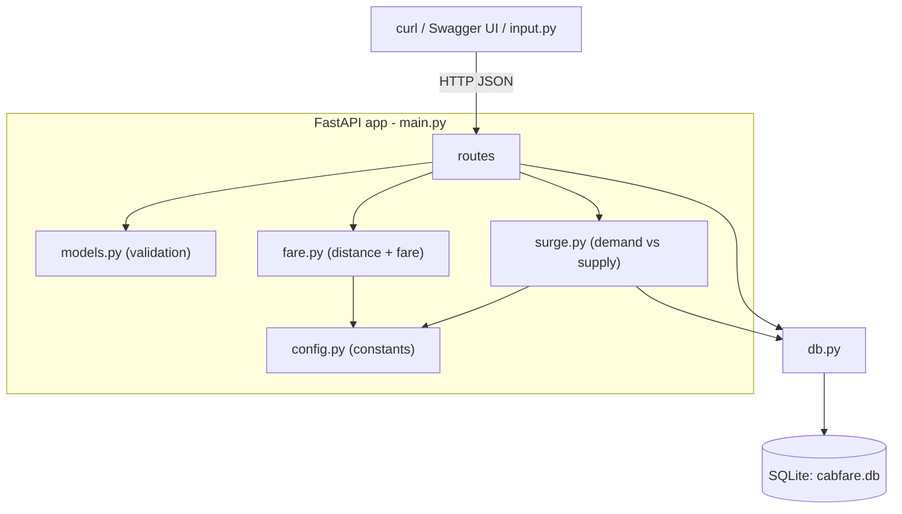
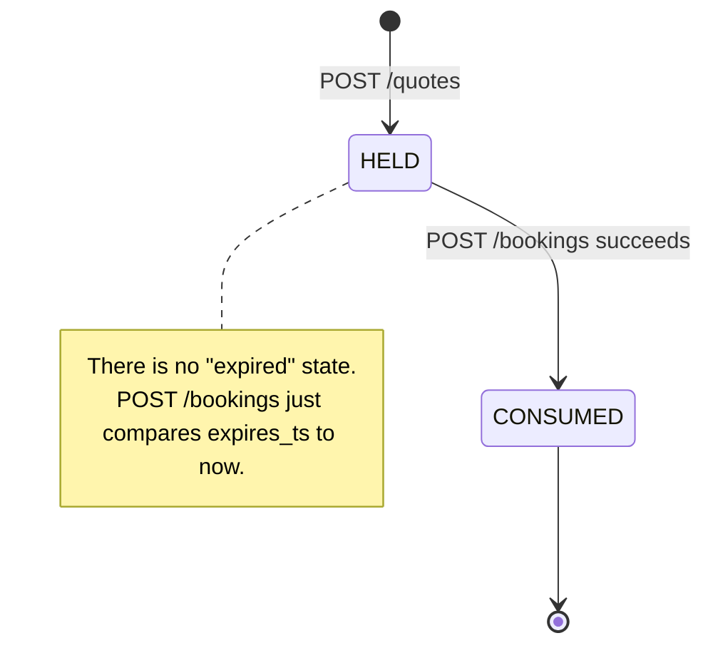

# Cab Fare Estimation Microservice


A tiny FastAPI + SQLite service that models how cab / delivery apps price a ride:
**quote → hold → book**, with **surge pricing** based on demand vs nearby drivers.

Built as a learning project. All money is in **INR** (whole rupees, 5% GST).
Design notes and the list of deliberate shortcuts are in [`DESIGN.md`](DESIGN.md).

---

## What it does


| Endpoint                  | Purpose                                                 |
| --------------------------- | --------------------------------------------------------- |
| `POST /quotes`            | Price a trip and hold that price for 120 seconds        |
| `POST /bookings`          | Turn a quote into a booking, locking the fare           |
| `GET /bookings?rider_id=` | A rider's bookings, newest first                        |
| `POST /drivers/heartbeat` | Update a driver's location + availability (feeds surge) |
| `GET /surge?lat=&lng=`    | Inspect demand / supply / multiplier for an area        |

FastAPI also serves interactive docs at **`/docs`**.

## Concepts used

| Concept | What it means here |
| --- | --- |
| REST API | Each feature is a URL you call with HTTP and get JSON back. |
| HTTP status codes | `200`/`201` success, `404` not found, `409` conflict, `422` invalid input. |
| Pydantic validation | `models.py` defines the exact shape of every request/response; bad input is auto-rejected with `422`. |
| SQLite tables & constraints | Data lives in a single-file database with typed columns and rules the DB enforces. |
| SQL transactions | The booking's read-check-insert is one `BEGIN IMMEDIATE` unit that fully succeeds or fully rolls back. |
| `UNIQUE` constraint | `bookings.quote_id` is unique, so a quote can be booked only once — this is the real double-booking guard. |
| Idempotent retries | Re-sending the same booking as the same rider returns the original booking instead of an error. |
| Quote state machine | A quote is `HELD`, then becomes `CONSUMED` on booking — no other transitions. |
| Lazy expiry | Old quotes are not cleaned up by a job; expiry is just checked when someone tries to book. |
| Haversine formula | Real great-circle distance between two latitude/longitude points. |
| Surge (dynamic) pricing | Price rises when recent demand outweighs nearby available drivers. |

---

## Architecture




| File        | Responsibility                                                         |
| ------------- | ------------------------------------------------------------------------ |
| `config.py` | All constants: fare rates, tax, speed, quote TTL, surge settings       |
| `db.py`     | SQLite connection,`CREATE TABLE` schema, seed ~11 sample drivers       |
| `fare.py`   | `haversine()`, duration, `build_fare_breakdown()` — pure functions    |
| `surge.py`  | Map cell key + demand/supply → surge multiplier                       |
| `models.py` | Pydantic schemas for every request and response                        |
| `main.py`   | FastAPI app, the 5 routes, startup,`uvicorn.run(...)`                  |
| `input.py`  | Optional CLI: geocode two addresses → quote →`estimate/estimate.txt` |

`cabfare.db` is created automatically on first run.

---

## Setup and run

**Requirements:** Python 3.10+. No API keys, no environment variables.

```bash
pip install fastapi uvicorn
python main.py            # http://127.0.0.1:8000  (docs at /docs)
```

On startup the tables are created and 11 sample drivers are seeded (Chennai and
Bengaluru), so `/surge` and `/quotes` return sensible values immediately.

### Optional: `input.py` (quote from street addresses)

`input.py` is a small client, not part of the service. It geocodes two addresses
with OpenStreetMap, calls `POST /quotes` and `GET /surge` (and `POST /bookings`
if you ask it to), prints a detailed breakdown, and saves the same report to
`estimate/estimate.txt`.

1. Keep the service running (`python main.py`) in another terminal.
2. Install the geocoding library: `pip install geopy` (needs internet).
3. Edit the constants at the top of `input.py`:


   | Constant                         | Meaning                                                  |
   | ---------------------------------- | ---------------------------------------------------------- |
   | `PICKUP_ADDRESS`, `DROP_ADDRESS` | the trip, as text addresses                              |
   | `PICKUP_LATLNG`, `DROP_LATLNG`   | set a`(lat, lng)` tuple to skip geocoding for that point |
   | `PRODUCT`                        | `standard` / `xl` / `premium`                            |
   | `RIDER_ID`, `RIDER_NAME`         | used only when booking                                   |
   | `BOOK`                           | `True` to also book the quote                            |
4. Run it:

   ```bash
   python input.py
   ```

   Output is printed to the terminal and written to `estimate/estimate.txt`
   (overwritten each run).

---

## Example: quote → book → verify

```bash
# 1. get a quote (Chennai -> Bengaluru, standard cab)
curl -s -X POST http://127.0.0.1:8000/quotes -H 'content-type: application/json' \
  -d '{"pickup":{"lat":13.0827,"lng":80.2763},"dropoff":{"lat":12.9776,"lng":77.5713},"product":"standard"}'
```

```json
{
  "quote_id": "qte-ba4e8f7ac872",
  "product": "standard", "currency": "INR",
  "distance_km": 381.123, "duration_min": 571.7,
  "breakdown": {"base": 50.0, "distance": 5336.0, "time": 858.0,
                "surge_mult": 1.0, "surge_amount": 0.0, "tax": 312.0, "total": 6555.0},
  "expires_at": 1788482771
}
```

```bash
# 2. book it (use the quote_id from step 1)
curl -s -X POST http://127.0.0.1:8000/bookings -H 'content-type: application/json' \
  -d '{"quote_id":"qte-ba4e8f7ac872","rider_id":"rider-1","rider_name":"Rohan Mehta"}'

# 3. verify
curl -s 'http://127.0.0.1:8000/bookings?rider_id=rider-1'
```

Booking the same quote again as the **same** rider returns the same booking
(`201`, idempotent). A **different** rider, or an expired quote, gets `409`.

---

## API reference

### `POST /quotes`

Body: `pickup {lat, lng}`, `dropoff {lat, lng}`, `product` (optional, one of
`standard` / `xl` / `premium`, default `standard`).
Returns `200` with `quote_id`, `distance_km`, `duration_min`, the fare
`breakdown`, and `expires_at` (epoch seconds).
`422` if the product is unknown or coordinates are out of range.

### `POST /bookings`

Body: `quote_id`, `rider_id`, `rider_name` (all required).
Returns `201` with the booking and the locked `total`.
`404` unknown quote · `409` quote consumed / expired / booked by someone else.
The whole check-and-insert runs in one `BEGIN IMMEDIATE` transaction; the
`bookings.quote_id UNIQUE` constraint is what actually blocks a double-book.

### `GET /bookings?rider_id=<id>`

Returns `200` with a JSON array of that rider's bookings, newest first.

### `POST /drivers/heartbeat`

Body: `driver_id`, `lat`, `lng`, `available` (bool).
Upserts the driver row with a fresh timestamp. Returns `{ok, driver_id, cell}`.

### `GET /surge?lat=&lng=`

Returns `{cell, demand, supply, ratio, peak, multiplier}` for that map cell.

---

## Data model (SQLite, 3 tables)

Timestamps are integer epoch seconds. No foreign keys are declared.

**drivers** — `id` (PK), `lat`, `lng`, `available` (0/1), `last_heartbeat_ts`.
Counts as surge supply only if `available = 1` and the heartbeat is < 180 s old.

**quotes** — `id` (PK), pickup/drop coords, `pickup_cell`, `product`,
`distance_km`, `duration_min`, `base_fare`, `surge_mult`, `surge_amount`, `tax`,
`total`, `status` (`HELD` / `CONSUMED`), `created_ts`, `expires_ts`.

**bookings** — `id` (PK), `quote_id` (**UNIQUE**), `rider_id`, `rider_name`,
`total` (locked fare), `created_ts`.



---

## Core logic

**Distance and duration** (`fare.py`):

```
distance_km  = haversine(pickup, dropoff) * ROAD_FACTOR   # ROAD_FACTOR = 1.30
duration_min = distance_km / AVG_SPEED_KMH * 60           # AVG_SPEED_KMH = 40
```

**Fare** (`build_fare_breakdown`), all rounded to whole rupees:

```
subtotal     = base + per_km * distance_km + per_min * duration_min
surge_amount = subtotal * (surge_mult - 1)
tax          = (subtotal + surge_amount) * 0.05           # 5% GST
total        = subtotal + surge_amount + tax
```


| Product    | Base  | Per km | Per min |
| ------------ | ------- | -------- | --------- |
| `standard` | ₹50  | ₹14   | ₹1.5   |
| `xl`       | ₹90  | ₹20   | ₹2.0   |
| `premium`  | ₹120 | ₹24   | ₹2.5   |

**Surge** (`surge.py`): `ratio = demand / max(supply, 1)`, where `demand` is
quotes in the cell in the last 10 minutes and `supply` is fresh, available
drivers in the cell. The ratio is bucketed:


| ratio  | multiplier |
| -------- | ------------ |
| ≤ 1.0 | 1.0        |
| ≤ 2.0 | 1.2        |
| ≤ 3.0 | 1.5        |
| > 3.0  | 2.0        |

If the current hour is a peak hour (`7-9`, `17-19`), the multiplier moves up one
bucket (capped at 2.0).

> Simplification: `demand` counts issued quotes, so calling `/quotes` repeatedly
> in one cell pushes surge up. A real system uses rider-side demand signals.

---

## Troubleshooting


| Problem                                             | Fix                                                                                         |
| ----------------------------------------------------- | --------------------------------------------------------------------------------------------- |
| `ModuleNotFoundError: fastapi`                      | `pip install fastapi uvicorn`                                                               |
| `input.py`: cannot reach `127.0.0.1:8000`           | Start`python main.py` first                                                                 |
| `input.py`: `could not geocode` / network error     | Use a clearer address, or set`PICKUP_LATLNG` / `DROP_LATLNG`                                |
| Port 8000 in use                                    | Change the port in`uvicorn.run(...)` in `main.py`                                           |
| `409` when booking                                  | Quote expired (120 s) or already booked — get a new one                                    |
| `/surge` always `1.0`                               | Seeded drivers are only in the Chennai/Bengaluru cells; send a heartbeat for your test cell |
| `no such column: rider_name` after pulling new code | `CREATE TABLE IF NOT EXISTS` doesn't alter old tables — delete `cabfare.db` and restart    |

---

## Possible extensions

Tests (`pytest`), `GET /quotes/{id}`, real `FOREIGN KEY`s, a routing API instead
of the flat road factor, an H3/S2 cell grid, surge hysteresis, a background
expiry job, auth, pagination.

## Author

Learning project by the repository owner (`@srummanf`).
