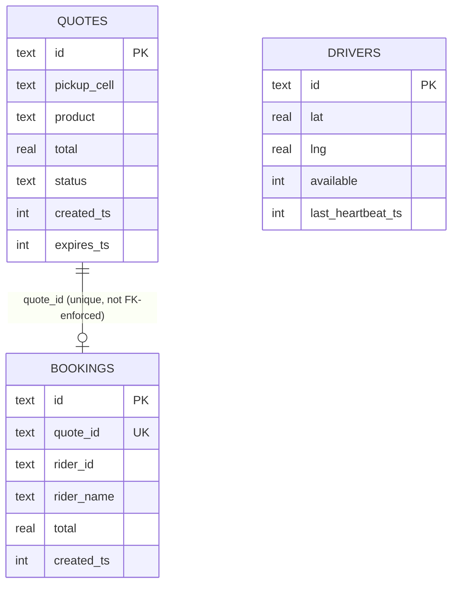
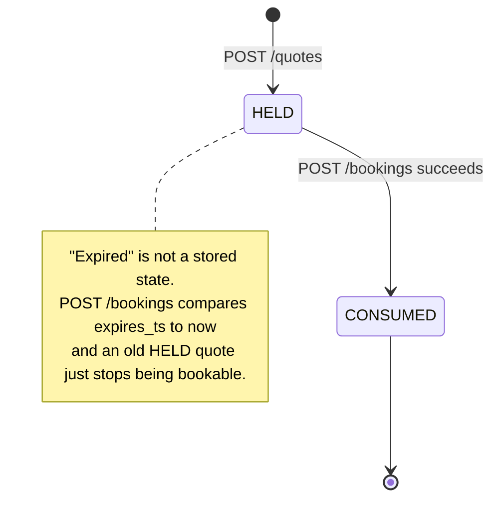
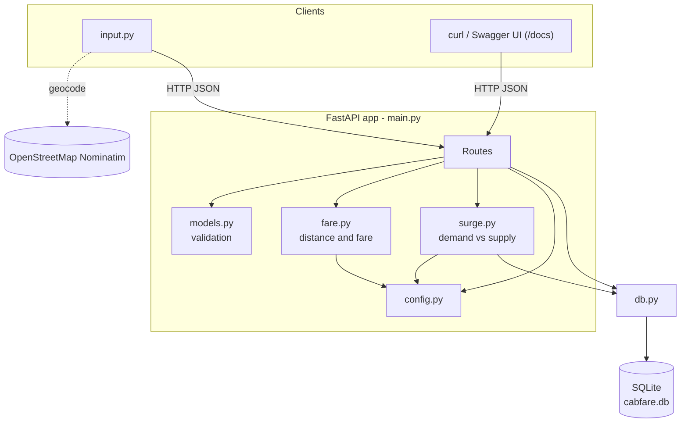
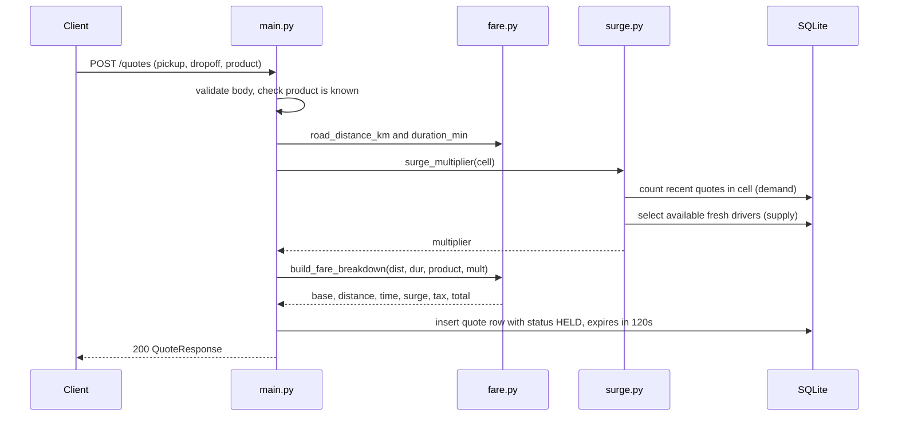
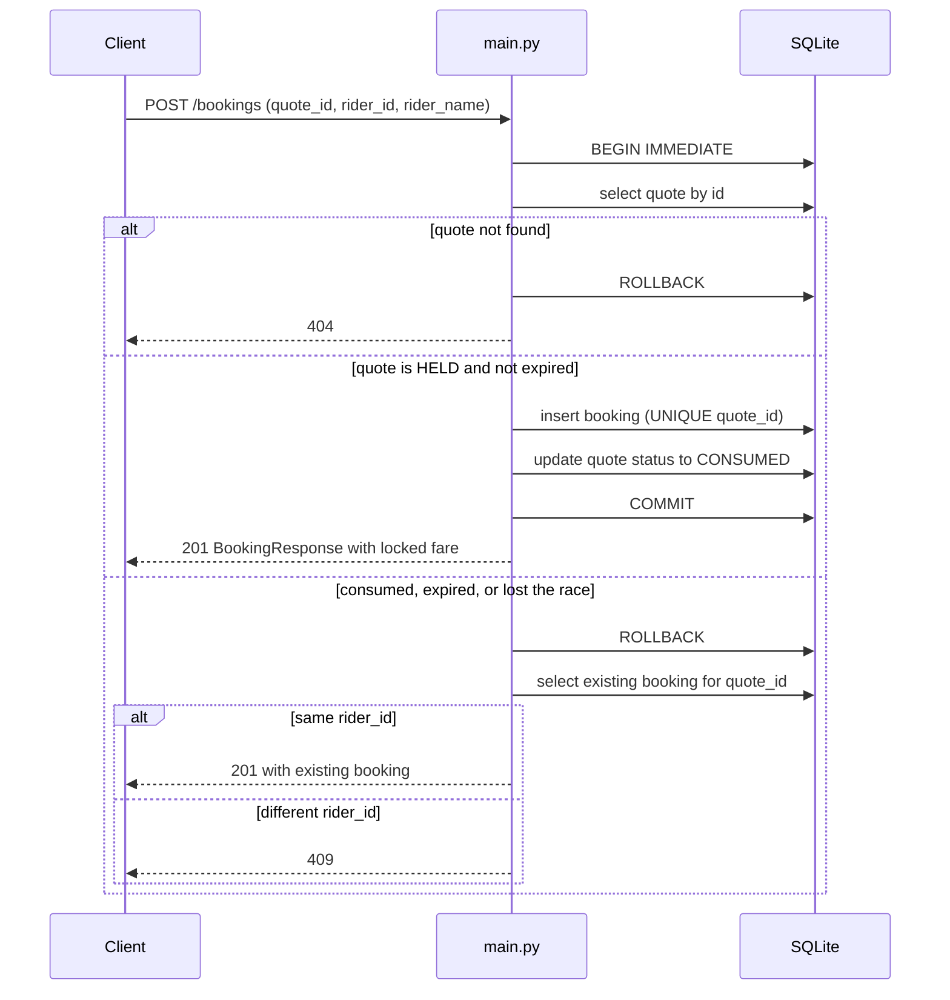

# Cab Fare Estimation Microservice


A tiny HTTP service that answers one question: **"How much will this cab ride
cost, and can I lock that price before I book?"**

It models the pricing path that ride-hailing and delivery apps (Uber, Ola,
food delivery) share: **quote → hold → book**, with **surge pricing** driven by
how many people are asking for rides versus how many drivers are free nearby.

The project is intentionally small and built for **learning backend / software
engineering**: one FastAPI app, one SQLite file, real distance math, and a set of
patterns (price locks, safe booking under races, lazy expiry, dynamic pricing)
that show up in real systems.

### Result — what was actually built

* A FastAPI service (`main.py`) exposing **5 JSON endpoints** for quotes,
  bookings, driver heartbeats, and a surge inspector.
* **Real geo math** — the haversine great-circle formula, scaled by a road
  factor; no mocked distances.
* **SQLite persistence** — three tables (`drivers`, `quotes`, `bookings`)
  created on startup and seeded with 11 sample drivers in Chennai and Bengaluru.
* A **safe booking transaction** that prevents double-booking a quote, using a
  `UNIQUE` constraint as the real guard.
* A **command-line client** (`input.py`) that turns two street addresses into a
  fully-described fare estimate saved to `estimate/estimate.txt`.
* All money in **Indian Rupees (INR)**, rounded to whole rupees, 5% GST.

### Where to start

1. Read [What problem this solves](#what-problem-this-solves) and
   [Concepts you need](#concepts-you-need).
2. Follow [Setup](#setup) (about 2 commands).
3. Do the [Run It End to End](#run-it-end-to-end) walkthrough.
4. Open **http://127.0.0.1:8000/docs** in a browser — FastAPI auto-generates an
   interactive page for every endpoint.

---

## Table of Contents

1. [What problem this solves](#what-problem-this-solves)
2. [Concepts you need](#concepts-you-need)
3. [How the whole thing fits together](#how-the-whole-thing-fits-together)
4. [Repository Map](#repository-map)
5. [Setup](#setup)
6. [Run It End to End](#run-it-end-to-end)
7. [Data Model](#data-model)
8. [Core Logic](#core-logic)
9. [API Reference](#api-reference)
10. [Architecture & UML](#architecture--uml)
11. [Reading the Results](#reading-the-results)
12. [Troubleshooting](#troubleshooting)
13. [Extending the Project](#extending-the-project)
14. [Lessons Learned](#lessons-learned)
15. [Documentation](#documentation)
16. [Contributing](#contributing)
17. [Author](#author)
18. [License](#license)
19. [Appendix](#appendix)

---

## What problem this solves

When you open a cab app and type a destination, several things happen before you
tap "Book":

1. The app estimates the **distance and time** for the trip.
2. It calculates a **fare** from that distance and time.
3. It may apply **surge pricing** if demand is high near your pickup.
4. It shows you a **price and holds it** for a short time so the number does not
   change while you decide.
5. When you book, it **charges exactly that held price**, even if surge changed
   in the meantime.

This project implements that flow as a backend service. It does **not** have a
mobile app, real maps routing, payments, or driver matching — those are out of
scope. What it does have is the pricing and booking *core*.

### What the application does


| Action                     | Endpoint                  | Result                                            |
| ---------------------------- | --------------------------- | --------------------------------------------------- |
| Ask for a price            | `POST /quotes`            | A priced quote, valid for 120 seconds             |
| Commit to a ride           | `POST /bookings`          | A booking that locks the quoted fare              |
| See your rides             | `GET /bookings?rider_id=` | That rider's bookings, newest first               |
| Report a driver's position | `POST /drivers/heartbeat` | Driver marked available/unavailable at a location |
| Inspect surge              | `GET /surge?lat=&lng=`    | Demand, supply, and the multiplier for an area    |

### Who / what interacts with it

* **Riders** (simulated) — call `POST /quotes` then `POST /bookings`.
* **Drivers** (simulated) — call `POST /drivers/heartbeat` periodically.
* **You**, via `curl`, the Swagger UI at `/docs`, or the `input.py` client.
* **`input.py`** also calls **OpenStreetMap Nominatim** to convert addresses to
  latitude/longitude.

### Why this is a good learning project

It is small enough to read in one sitting, but it exercises: REST API design,
request validation, relational data modelling, SQL transactions and constraints,
a state machine, concurrency safety, idempotency, and a real formula. Each
"toy" simplification is written down (see [`DESIGN.md`](DESIGN.md)) so you can
see the line between the pattern and the shortcut.

---

## Concepts you need

You only need a working understanding of these. Each one is used somewhere in the
code.


| Concept                         | What it means here                                                                                                                                              | Where it shows up          |
| --------------------------------- | ----------------------------------------------------------------------------------------------------------------------------------------------------------------- | ---------------------------- |
| **REST API**                    | The service is a set of URLs you call with HTTP; each returns JSON.                                                                                             | `main.py` routes           |
| **HTTP methods**                | `POST` creates/changes things (`/quotes`, `/bookings`, `/drivers/heartbeat`); `GET` reads (`/bookings`, `/surge`).                                              | `main.py`                  |
| **HTTP status codes**           | `200` ok, `201` created, `404` not found, `409` conflict, `422` invalid input.                                                                                  | responses                  |
| **Request/response validation** | Pydantic models describe the exact shape of every request and response; bad input is rejected automatically with`422`.                                          | `models.py`                |
| **Relational database**         | Data lives in tables with typed columns. We use SQLite, a database that is just a single file.                                                                  | `db.py`                    |
| **SQL transaction**             | A group of statements that either all succeed or all roll back. Used so a booking cannot half-happen.                                                           | `main.py` `create_booking` |
| **`UNIQUE` constraint**         | The database refuses a second row with the same value in a column. Here:`bookings.quote_id`. This is what actually stops double-booking.                        | `db.py` schema             |
| **Idempotency**                 | Calling the same operation twice has the same effect as calling it once. A repeated booking by the same rider returns the original booking instead of erroring. | `main.py`                  |
| **State machine**               | A`quote` moves through fixed states: `HELD` → `CONSUMED`.                                                                                                      | `quotes.status`            |
| **Lazy evaluation**             | Quote expiry is checked only when someone tries to book — there is no background job deleting old quotes.                                                      | `create_booking`           |
| **Dynamic (surge) pricing**     | Price goes up when demand exceeds nearby supply.                                                                                                                | `surge.py`                 |
| **Haversine formula**           | Computes the great-circle distance between two points on a sphere from their latitude/longitude.                                                                | `fare.py`                  |
| **Geocoding**                   | Turning a text address into coordinates. Done by an external service (OpenStreetMap).                                                                           | `input.py`                 |
| **Separation of concerns**      | Pure calculation (`fare.py`) is kept separate from database code (`db.py`) and HTTP code (`main.py`).                                                           | project layout             |

---

## How the whole thing fits together

```text
Address text (input.py only)
   │  geocode via OpenStreetMap Nominatim
   ▼
Coordinates + product  ──HTTP──▶  FastAPI app (main.py)
                                     │
                                     ├─ validate body/query  (models.py)
                                     ├─ distance & fare       (fare.py  → config.py)
                                     ├─ surge multiplier      (surge.py → config.py + SQLite)
                                     └─ read/write rows       (db.py    → SQLite: cabfare.db)
                                     │
                                     ▼
                              JSON response  ──▶  client
                                     │  (input.py also writes estimate/estimate.txt)
```

**The main request flow, in plain words:**

1. A client sends `POST /quotes` with pickup coordinates, dropoff coordinates,
   and a product name (`standard`, `xl`, or `premium`).
2. `main.py` validates the JSON against `QuoteRequest`.
3. `fare.py` computes the straight-line distance (haversine), multiplies it by
   `ROAD_FACTOR` to approximate road distance, and divides by `AVG_SPEED_KMH` to
   estimate the duration.
4. `surge.py` looks at the SQLite database: how many quotes were made recently in
   this map cell (demand) versus how many available drivers are in it (supply),
   and returns a multiplier.
5. `fare.py` builds the fare breakdown (base + distance + time + surge + tax).
6. `main.py` writes the quote to the `quotes` table with status `HELD` and an
   `expires_ts` 120 seconds in the future, then returns the breakdown.
7. Later, the client sends `POST /bookings` with the `quote_id`. Inside one
   transaction, `main.py` re-checks the quote is still `HELD` and not expired,
   inserts a `bookings` row, and flips the quote to `CONSUMED`.

---

## Repository Map

```text
cab fare estimation/
├── config.py          Constants only: fare rates, tax, speed, TTL, surge params
├── db.py              SQLite connection helper, CREATE TABLE schema, seed drivers
├── fare.py            haversine distance, duration, fare breakdown (pure functions)
├── surge.py           demand vs supply  ->  surge multiplier
├── models.py          Pydantic request/response schemas
├── main.py            FastAPI app: the 5 routes + `uvicorn.run` entrypoint
├── input.py           CLI client: address -> geocode -> quote -> estimate/estimate.txt
├── estimate/
│   └── estimate.txt   Generated sample estimate (overwritten each `python input.py`)
├── DESIGN.md          Design notes + the list of deliberate simplifications
├── README.md          This file
└── .gitignore
```

`cabfare.db` (the SQLite database file) is **created at runtime** by `db.init_db()`
and is git-ignored.

### File responsibilities


| File        | Responsibility                                                                                                                                                                                                                                 |
| ------------- | ------------------------------------------------------------------------------------------------------------------------------------------------------------------------------------------------------------------------------------------------ |
| `config.py` | All tunable numbers in one place:`PRODUCTS` rate table, `TAX_RATE`, `AVG_SPEED_KMH`, `ROAD_FACTOR`, `QUOTE_TTL_SECONDS`, `SURGE_WINDOW_MINUTES`, `DRIVER_FRESH_SECONDS`, `CELL_PRECISION`, `PEAK_HOURS`, `SURGE_BUCKETS`. No functions.        |
| `db.py`     | `now_ts()` (one epoch-seconds clock), `get_conn()` (a new SQLite connection per request, `Row` factory), `SCHEMA` / `init_db()` (create the 3 tables + 1 index if missing), `seed()` (insert 11 drivers once).                                 |
| `fare.py`   | Pure functions, no I/O:`haversine()`, `road_distance_km()`, `duration_min()`, `build_fare_breakdown()` returning a dict of money fields.                                                                                                       |
| `surge.py`  | `cell_for(lat, lng)` (the map-grid key), `surge_stats(cell)` (queries the DB for demand and supply, returns the full dict the `/surge` endpoint sends), `surge_multiplier(cell)` (just the number, used by `/quotes`).                         |
| `models.py` | `LatLng`, `QuoteRequest`, `FareBreakdown`, `QuoteResponse`, `BookingRequest`, `BookingResponse`, `HeartbeatRequest`. Coordinate ranges are enforced here.                                                                                      |
| `main.py`   | Creates the FastAPI`app`, runs `init_db()` + `seed()` on startup (lifespan), defines all 5 routes, and starts uvicorn on `127.0.0.1:8000` when run directly.                                                                                   |
| `input.py`  | Not part of the service. Hardcoded trip constants at the top; geocodes the two addresses with`geopy`, calls `POST /quotes`, `GET /surge`, and optionally `POST /bookings`, prints a detailed report, and writes it to `estimate/estimate.txt`. |

---

## Setup

### Requirements


| Item                   | Version / note                                                                                                     |
| ------------------------ | -------------------------------------------------------------------------------------------------------------------- |
| Python                 | **3.10 or newer** (the code uses `X                                                                                |
| OS                     | Any. Commands below are shown for Windows PowerShell and a POSIX shell.                                            |
| Internet               | Only needed by`input.py` for geocoding. The service itself is fully offline.                                       |
| Credentials / API keys | **None.** OpenStreetMap Nominatim needs no key. There are no environment variables and no config files to fill in. |

### Dependencies

Installed with `pip` (no lock file or package manager config is committed):


| Package    | Used by         | Purpose                                                         |
| ------------ | ----------------- | ----------------------------------------------------------------- |
| `fastapi`  | `main.py`       | Web framework + automatic validation +`/docs`                   |
| `uvicorn`  | `main.py`       | ASGI server that actually runs the app                          |
| `pydantic` | `models.py`     | Request/response schemas (installed automatically with FastAPI) |
| `geopy`    | `input.py` only | Geocoding client for OpenStreetMap Nominatim                    |

### Install

```bash
# service
pip install fastapi uvicorn

# extra, only if you want to use input.py with street addresses
pip install geopy
```

### Database setup

Nothing to do. On startup `main.py` calls:

* `db.init_db()` — runs `CREATE TABLE IF NOT EXISTS ...` for `drivers`, `quotes`,
  `bookings`, plus one index.
* `db.seed()` — if the `drivers` table is empty, inserts 11 sample drivers.

The database file `cabfare.db` appears next to the code. Delete it any time to
start fresh (see [Troubleshooting](#troubleshooting) for when you must).

### Start the service

```bash
python main.py
```

You should see uvicorn report `Uvicorn running on http://127.0.0.1:8000`.
Interactive docs: **http://127.0.0.1:8000/docs**.

Stop it with `Ctrl+C`.

---

## Run It End to End

This is the full happy path. Keep the service running in one terminal and use a
second terminal for the calls. `curl` examples use a POSIX shell; on PowerShell,
escape the inner quotes or use the `/docs` page instead.

### Step 1 — check surge for a pickup area

```bash
curl -s 'http://127.0.0.1:8000/surge?lat=13.0827&lng=80.2763'
```

```json
{"cell":"13.08,80.28","demand":0,"supply":6,"ratio":0.0,"peak":false,"multiplier":1.0}
```

**What happened internally:** `surge.py` rounded the coordinates to the cell
`13.08,80.28`, counted `quotes` rows created in that cell in the last 10 minutes
(0), counted seeded drivers that are `available` and in that cell (6 — the
Chennai group minus one who is off duty), computed `ratio = 0 / max(6,1) = 0`,
and bucketed that to a `1.0` multiplier.

### Step 2 — request a quote

```bash
curl -s -X POST http://127.0.0.1:8000/quotes \
  -H 'content-type: application/json' \
  -d '{"pickup":{"lat":13.0827,"lng":80.2763},
       "dropoff":{"lat":12.9776,"lng":77.5713},
       "product":"standard"}'
```

```json
{
  "quote_id": "qte-ba4e8f7ac872",
  "product": "standard",
  "currency": "INR",
  "distance_km": 381.123,
  "duration_min": 571.7,
  "breakdown": {
    "base": 50.0,
    "distance": 5336.0,
    "time": 858.0,
    "surge_mult": 1.0,
    "surge_amount": 0.0,
    "tax": 312.0,
    "total": 6555.0
  },
  "expires_at": 1788482771
}
```

(Your exact numbers depend on the precise coordinates.) **Internally:** distance
= `haversine × 1.30`, duration = `distance / 40 km/h × 60`, fare = base +
`₹14/km × distance` + `₹1.5/min × duration`, then surge, then 5% GST. A row is
written to `quotes` with `status = 'HELD'` and `expires_ts = now + 120`.

### Step 3 — book the quote

Copy the `quote_id` from step 2.

```bash
curl -s -X POST http://127.0.0.1:8000/bookings \
  -H 'content-type: application/json' \
  -d '{"quote_id":"qte-ba4e8f7ac872",
       "rider_id":"rider-1",
       "rider_name":"Rohan Mehta"}'
```

```json
{
  "booking_id": "bkg-47e8df6b3045",
  "quote_id": "qte-ba4e8f7ac872",
  "rider_id": "rider-1",
  "rider_name": "Rohan Mehta",
  "currency": "INR",
  "total": 6555.0,
  "created_ts": 1788482232
}
```

HTTP status `201`. **Internally:** one `BEGIN IMMEDIATE` transaction re-reads the
quote, confirms it is `HELD` and `expires_ts >= now`, inserts the `bookings` row
(the `UNIQUE(quote_id)` constraint would reject a second one), sets the quote to
`CONSUMED`, and commits.

### Step 4 — verify

```bash
curl -s 'http://127.0.0.1:8000/bookings?rider_id=rider-1'
```

```json
[{"booking_id":"bkg-47e8df6b3045","quote_id":"qte-ba4e8f7ac872",
  "rider_id":"rider-1","rider_name":"Rohan Mehta","total":6555.0,
  "created_ts":1788482232,"currency":"INR"}]
```

Try to book the same quote again:

* **Same `rider_id`** → you get the *same* booking back, status `201` (idempotent
  retry).
* **Different `rider_id`** → `409 {"detail":"quote is not bookable (expired, or already booked)"}`.

Wait 120 seconds and book a fresh quote → `409` (expired).

### Step 5 — do it from addresses instead

```bash
pip install geopy
python input.py
```

`input.py` geocodes *Chennai Central Railway Station* and *Kempegowda Bus
Station*, runs steps 1–2 (and step 3 if you set `BOOK = True` near the top of the
file), prints a detailed breakdown, and writes it to `estimate/estimate.txt`.
See [Reading the Results](#reading-the-results).

---

## Data Model

SQLite database `cabfare.db`, three tables, created by `db.py`. Timestamps are
**integer epoch seconds** from `now_ts()`. There are **no foreign keys declared**
— `bookings.quote_id` refers to `quotes.id` only by convention.

### `drivers`

One row per driver, refreshed by `POST /drivers/heartbeat`.


| Column              | Type    | Notes                               |
| --------------------- | --------- | ------------------------------------- |
| `id`                | TEXT    | Primary key (e.g.`drv-suresh`)      |
| `lat`               | REAL    | Latitude                            |
| `lng`               | REAL    | Longitude                           |
| `available`         | INTEGER | `1` = free, `0` = off duty          |
| `last_heartbeat_ts` | INTEGER | Epoch seconds of the last heartbeat |

A driver counts as **surge supply** only if `available = 1` **and**
`last_heartbeat_ts` is within `DRIVER_FRESH_SECONDS` (180 s) of now.

### `quotes`

One row per price quote. This is the price-lock record.


| Column                     | Type    | Notes                                                    |
| ---------------------------- | --------- | ---------------------------------------------------------- |
| `id`                       | TEXT    | Primary key (e.g.`qte-...`)                              |
| `pickup_lat`, `pickup_lng` | REAL    | Pickup coordinates as sent                               |
| `drop_lat`, `drop_lng`     | REAL    | Dropoff coordinates as sent                              |
| `pickup_cell`              | TEXT    | `"round(lat,2),round(lng,2)"` — the surge grid key      |
| `product`                  | TEXT    | `standard` \| `xl` \| `premium`                          |
| `distance_km`              | REAL    | Road distance used for the fare                          |
| `duration_min`             | REAL    | Estimated duration                                       |
| `base_fare`                | REAL    | The flat drop fee only (the`base` line of the breakdown) |
| `surge_mult`               | REAL    | Multiplier applied (1.0 / 1.2 / 1.5 / 2.0)               |
| `surge_amount`             | REAL    | Extra rupees from surge                                  |
| `tax`                      | REAL    | GST amount                                               |
| `total`                    | REAL    | Final fare — this is what a booking locks               |
| `status`                   | TEXT    | **`HELD`** or **`CONSUMED`**                             |
| `created_ts`               | INTEGER | When the quote was made                                  |
| `expires_ts`               | INTEGER | `created_ts + QUOTE_TTL_SECONDS` (120 s later)           |

Index: `idx_quotes_cell_created (pickup_cell, created_ts)` — makes the surge
"count recent quotes in this cell" query fast.

### `bookings`

One row per booking. Consumes exactly one quote.


| Column       | Type    | Notes                                                   |
| -------------- | --------- | --------------------------------------------------------- |
| `id`         | TEXT    | Primary key (e.g.`bkg-...`)                             |
| `quote_id`   | TEXT    | **`UNIQUE NOT NULL`** — the double-booking guard       |
| `rider_id`   | TEXT    | Free text, no lookup table                              |
| `rider_name` | TEXT    | Free text, supplied on the request                      |
| `total`      | REAL    | Copied from the quote at booking time (the locked fare) |
| `created_ts` | INTEGER | When the booking was made                               |

### Relationships

`bookings.quote_id` is `UNIQUE` and points at `quotes.id`, but there is **no
`FOREIGN KEY`** in the schema. `drivers` has no column linking it to `quotes`;
they are related only indirectly, through the surge cell string.



---

## Core Logic

### Implemented capabilities

* Price a trip between two coordinates for one of three product classes.
* Approximate real road distance and duration from coordinates (no maps API).
* Compute a surge multiplier from recent demand versus nearby available supply,
  with a peak-hours bump.
* Lock a quoted price for 120 seconds (`HELD` state).
* Convert a `HELD` quote into exactly one booking, safely even if two requests
  arrive at once.
* Treat a repeated booking by the same rider as an idempotent retry.
* Track driver availability and location via heartbeats.
* Expose a read-only surge inspector.

### 1. Distance and duration (`fare.py`)

**Input:** two `(lat, lng)` pairs.
**Processing:**

```
straight_km  = haversine(lat1, lng1, lat2, lng2)          # great-circle km
road_km      = straight_km * ROAD_FACTOR                  # ROAD_FACTOR = 1.30
duration_min = road_km / AVG_SPEED_KMH * 60               # AVG_SPEED_KMH = 40
```

`haversine` uses the standard formula with Earth radius `6371.0088 km`.
**Output:** `road_km` (used as `distance_km`) and `duration_min`.
**Why:** the haversine part is exact and free. Real routing needs a maps API,
which is out of scope, so a flat 1.30 detour factor and a single average speed
stand in. This is honest about being an estimate. Long intercity trips
over-estimate the time (a constant 40 km/h is a city speed).

### 2. Fare breakdown (`fare.py` → `build_fare_breakdown`)

**Input:** `distance_km`, `duration_min`, `product`, `surge_mult`.
**Processing:**

```
base         = PRODUCTS[product]["base"]                  # flat drop fee
distance     = PRODUCTS[product]["per_km"]  * distance_km
time         = PRODUCTS[product]["per_min"] * duration_min
subtotal     = base + distance + time
surge_amount = subtotal * (surge_mult - 1.0)              # 0 when multiplier is 1.0
tax          = (subtotal + surge_amount) * TAX_RATE       # TAX_RATE = 0.05 (5% GST)
total        = subtotal + surge_amount + tax
```

Every money value is **rounded to a whole rupee**. `surge_mult` is passed through
unrounded.
**Output:** `{base, distance, time, surge_mult, surge_amount, tax, total}`.
**Why this shape:** surge is expressed as an *added amount* on top of the
subtotal, not a rewrite of it, so the breakdown still adds up and you can see
exactly how much the multiplier cost you. Tax is charged on the surged amount,
matching how GST works on the final ride price.

Rate table (`config.PRODUCTS`):


| Product                | Base  | Per km | Per min |
| ------------------------ | ------- | -------- | --------- |
| `standard` (hatchback) | ₹50  | ₹14   | ₹1.5   |
| `xl` (SUV / 6-seater)  | ₹90  | ₹20   | ₹2.0   |
| `premium` (sedan)      | ₹120 | ₹24   | ₹2.5   |

### 3. Surge multiplier (`surge.py`)

**Input:** a cell string like `"13.08,80.28"`.
**Processing:**

```
cell    = "round(lat, 2),round(lng, 2)"                   # CELL_PRECISION = 2
demand  = COUNT(quotes) WHERE pickup_cell = cell
                        AND created_ts >= now - 10*60      # SURGE_WINDOW_MINUTES
supply  = number of drivers WHERE available = 1
                        AND last_heartbeat_ts >= now - 180 # DRIVER_FRESH_SECONDS
                        AND their rounded cell == cell
ratio   = demand / max(supply, 1)
```

`ratio` is bucketed to one of `{1.0, 1.2, 1.5, 2.0}`:


| `ratio` | Base multiplier |
| --------- | ----------------- |
| ≤ 1.0  | 1.0             |
| ≤ 2.0  | 1.2             |
| ≤ 3.0  | 1.5             |
| > 3.0   | 2.0             |

Then, if the **current local hour** is in `PEAK_HOURS` (`7, 8, 9, 17, 18, 19`),
the multiplier is bumped **one bucket up**, capped at 2.0.
**Output:** `{cell, demand, supply, ratio, peak, multiplier}`.
**Why:** bucketing keeps prices predictable (riders see 1.2×, not 1.237×) and the
cap limits the worst case. `max(supply, 1)` avoids dividing by zero.

> **Known simplification (also noted in the code):** `demand` counts *issued
> quotes*, so every `POST /quotes` call nudges surge upward — even quotes that
> are never booked. A real engine would measure rider-side demand signals.

### 4. Quote lifecycle and lazy expiry



There is no background task. An expired quote stays in the table as `HELD`
forever; it is simply rejected at booking time. This keeps the service to a
single process with no scheduler.

### 5. Safe booking under concurrency (`main.py` → `create_booking`)

**Input:** `{quote_id, rider_id, rider_name}`.
**Processing (all inside one transaction):**

```
conn.isolation_level = None
BEGIN IMMEDIATE                        # take the write lock now
row = SELECT * FROM quotes WHERE id = quote_id
if row is None:            ROLLBACK  -> 404
bookable = row.status == 'HELD' and row.expires_ts >= now
if bookable:
    try:
        INSERT INTO bookings (...)     # UNIQUE(quote_id) may raise here
        UPDATE quotes SET status = 'CONSUMED'
        COMMIT                         -> 201 with the locked fare
    except IntegrityError:
        ROLLBACK                       # we lost a race; fall through
else:
    ROLLBACK
# fell through: not bookable, or lost the INSERT race
existing = SELECT * FROM bookings WHERE quote_id = quote_id
if existing and existing.rider_id == rider_id:  -> 201 (return existing booking)
else:                                            -> 409
```

**Output:** `201` with a `BookingResponse`, or `404` / `409`.
**Why it is safe:** `BEGIN IMMEDIATE` serialises the read-check-insert against
other bookings. But the *real* guarantee is the `UNIQUE(quote_id)` constraint: if
two requests somehow both pass the status check, only one `INSERT` can commit and
the other gets an `IntegrityError`. The loser then checks whether *it* is the
same rider — if so the call is treated as a retry and the existing booking is
returned; otherwise it is a genuine conflict (`409`). This is a standard
"let the database enforce the invariant" pattern.

---

## API Reference

Base URL: `http://127.0.0.1:8000`. All request and response bodies are JSON.
FastAPI also serves `/docs` (Swagger UI), `/redoc`, and `/openapi.json`.


| Method | Endpoint             | Purpose                                             |
| -------- | ---------------------- | ----------------------------------------------------- |
| `POST` | `/quotes`            | Create a priced, time-limited quote                 |
| `POST` | `/bookings`          | Book a quote and lock its fare                      |
| `GET`  | `/bookings`          | List one rider's bookings, newest first             |
| `POST` | `/drivers/heartbeat` | Upsert a driver's position and availability         |
| `GET`  | `/surge`             | Inspect demand / supply / multiplier for a location |

### `POST /quotes`

**Request body** (`QuoteRequest`):


| Field         | Type   | Rules                                                                |
| --------------- | -------- | ---------------------------------------------------------------------- |
| `pickup.lat`  | float  | −90 … 90                                                           |
| `pickup.lng`  | float  | −180 … 180                                                         |
| `dropoff.lat` | float  | −90 … 90                                                           |
| `dropoff.lng` | float  | −180 … 180                                                         |
| `product`     | string | optional, default`"standard"`; must be `standard` / `xl` / `premium` |

**Response `200`** (`QuoteResponse`):


| Field          | Type   | Notes                                                        |
| ---------------- | -------- | -------------------------------------------------------------- |
| `quote_id`     | string | `qte-` + 12 hex chars                                        |
| `product`      | string | echoed                                                       |
| `currency`     | string | always`"INR"`                                                |
| `distance_km`  | float  | road distance, 3 decimals                                    |
| `duration_min` | float  | 1 decimal                                                    |
| `breakdown`    | object | `base, distance, time, surge_mult, surge_amount, tax, total` |
| `expires_at`   | int    | epoch seconds;`created + 120`                                |

**Status codes:** `200` ok · `422` unknown product (`{"detail":"unknown product 'x'"}`) or invalid body.
**Side effect:** inserts one `quotes` row with `status = 'HELD'`.

```bash
curl -s -X POST http://127.0.0.1:8000/quotes -H 'content-type: application/json' \
  -d '{"pickup":{"lat":13.0827,"lng":80.2763},"dropoff":{"lat":12.9776,"lng":77.5713},"product":"xl"}'
```

### `POST /bookings`

**Request body** (`BookingRequest`):


| Field        | Type   | Rules    |
| -------------- | -------- | ---------- |
| `quote_id`   | string | required |
| `rider_id`   | string | required |
| `rider_name` | string | required |

**Response `201`** (`BookingResponse`): `booking_id`, `quote_id`, `rider_id`,
`rider_name`, `currency`, `total` (the locked fare), `created_ts` (epoch seconds).

**Status codes:**


| Code  | When                                                                |
| ------- | --------------------------------------------------------------------- |
| `201` | Booking created**or** idempotent retry by the same rider            |
| `404` | `quote_id` does not exist (`{"detail":"quote not found"}`)          |
| `409` | Quote is`CONSUMED`, expired, or already booked by a different rider |
| `422` | A required field is missing                                         |

**Side effects:** inserts one `bookings` row; sets the quote's `status` to
`CONSUMED`. Runs inside one `BEGIN IMMEDIATE` transaction.

```bash
curl -s -X POST http://127.0.0.1:8000/bookings -H 'content-type: application/json' \
  -d '{"quote_id":"qte-XXXX","rider_id":"rider-1","rider_name":"Rohan Mehta"}'
```

### `GET /bookings`

**Query parameters:** `rider_id` (string, **required** — `422` if missing).

**Response `200`:** a JSON array (possibly empty), ordered newest first. Each
element: `booking_id`, `quote_id`, `rider_id`, `rider_name`, `total`,
`created_ts`, `currency`.

```bash
curl -s 'http://127.0.0.1:8000/bookings?rider_id=rider-1'
```

### `POST /drivers/heartbeat`

**Request body** (`HeartbeatRequest`):


| Field       | Type   | Rules                    |
| ------------- | -------- | -------------------------- |
| `driver_id` | string | required; the upsert key |
| `lat`       | float  | −90 … 90               |
| `lng`       | float  | −180 … 180             |
| `available` | bool   | required                 |

**Response `200`:** `{"ok": true, "driver_id": "...", "cell": "13.08,80.28"}`
— `cell` is the surge grid square the driver is in.
**Side effect:** `INSERT ... ON CONFLICT(id) DO UPDATE` on `drivers`, always
setting `last_heartbeat_ts = now`.

```bash
curl -s -X POST http://127.0.0.1:8000/drivers/heartbeat -H 'content-type: application/json' \
  -d '{"driver_id":"drv-ravi","lat":13.0827,"lng":80.2763,"available":true}'
```

### `GET /surge`

**Query parameters:** `lat` (float, required), `lng` (float, required) —
`422` if either is missing.

**Response `200`:**


| Field        | Type   | Meaning                                    |
| -------------- | -------- | -------------------------------------------- |
| `cell`       | string | `"round(lat,2),round(lng,2)"`              |
| `demand`     | int    | quotes in this cell in the last 10 minutes |
| `supply`     | int    | available, fresh drivers in this cell      |
| `ratio`      | float  | `demand / max(supply, 1)`, 2 decimals      |
| `peak`       | bool   | is the current local hour a peak hour      |
| `multiplier` | float  | one of`1.0, 1.2, 1.5, 2.0`                 |

```bash
curl -s 'http://127.0.0.1:8000/surge?lat=13.0827&lng=80.2763'
```

---

## Architecture & UML

### Components


| Component   | Responsibility                                            | Depends on                                                  |
| ------------- | ----------------------------------------------------------- | ------------------------------------------------------------- |
| `main.py`   | HTTP layer: routing, orchestration, transactions, startup | `models`, `fare`, `surge`, `db`, `config`, FastAPI, uvicorn |
| `models.py` | Define and enforce the shape of every request/response    | pydantic                                                    |
| `fare.py`   | Distance, duration, fare math —**pure**, no DB, no HTTP  | `config`                                                    |
| `surge.py`  | Surge multiplier from DB state                            | `config`, `db`                                              |
| `db.py`     | SQLite connection, schema, seed                           | `config`, stdlib `sqlite3`                                  |
| `config.py` | Constants                                                 | nothing                                                     |
| `input.py`  | External CLI client                                       | `geopy`, `config`, stdlib `urllib`                          |

Design decisions worth noting:

* **Pure vs impure split.** `fare.py` has no imports from `db` — you can unit-test
  every fare number without a database. `surge.py` and `main.py` are where I/O
  lives.
* **One connection per request** (`get_conn()`), closed in the same function.
  Simple, and fine for a single-worker learning service.
* **`config.py` holds only data.** Changing a fare rate or the quote TTL is a
  one-line edit with no logic to reread.
* **The database enforces the key invariant** (`UNIQUE(quote_id)`) rather than
  application code trying to be careful.



### Sequence — `POST /quotes`



### Sequence — `POST /bookings`



---

## Reading the Results

### A quote response

* `breakdown.total` is the number that matters — the fare you would pay.
* `breakdown.surge_amount` shows how many rupees surge added. `0.0` means no
  surge (`surge_mult` is `1.0`).
* `expires_at` is epoch seconds. Compare it to the current time: if it is in the
  past, `POST /bookings` will return `409`.
* `distance_km` is **road** distance (haversine × 1.30), not straight-line.

### A `/surge` response

Read it as a fraction: `demand / max(supply, 1) = ratio`, then look up the
bucket. `peak: true` means one extra bucket was added. If `supply` is `0`, either
no drivers are seeded/heartbeating in that cell or their last heartbeat is older
than 180 seconds.

### `estimate/estimate.txt` (from `input.py`)

`input.py` writes a full report (overwriting the file each run). Layout:


| Section           | Right-hand tag           | Content                                                                           |
| ------------------- | -------------------------- | ----------------------------------------------------------------------------------- |
| Header            | —                       | timestamp, service URL, currency, the sequence of calls made                      |
| `TRIP`            | `geopy -> OpenStreetMap` | both addresses, geocoded coordinates, surge cell, product rate card               |
| `DISTANCE & TIME` | `POST /quotes`           | straight-line km → road factor → road km; assumed speed → duration             |
| `FARE BREAKDOWN`  | `POST /quotes`           | base / distance / time / subtotal / surge / GST / total, each with the arithmetic |
| `SURGE PRICING`   | `GET /surge`             | demand, supply, ratio, peak flag, multiplier, all explained                       |
| `QUOTE`           | `POST /quotes`           | quote id,`HELD` status, expiry time and seconds left                              |
| `BOOKING`         | `POST /bookings`         | "not requested", or the booking id / rider / locked fare / HTTP 201               |

Example (trimmed):

```text
--------------------------------------------------------------------------------
FARE BREAKDOWN  (INR)                                               POST /quotes
--------------------------------------------------------------------------------
  Base fare           ₹       50   flat drop charge for 'standard'
  Distance charge     ₹    5,336   ₹14/km x 381.123 km
  Time charge         ₹      858   ₹1.5/min x 571.7 min
                      ----------
  Subtotal            ₹    6,244   base + distance + time
  Surge               ₹        0   subtotal x (x1.00 - 1) — see SURGE below
                      ----------
  Taxable amount      ₹    6,244
  GST @ 5%            ₹      312   government tax on the ride
                      ==========
  TOTAL FARE          ₹    6,555
                      ==========
```

### Inspecting the database directly

```bash
sqlite3 cabfare.db "SELECT id, status, total, expires_ts FROM quotes ORDER BY created_ts DESC LIMIT 5;"
sqlite3 cabfare.db "SELECT * FROM bookings;"
sqlite3 cabfare.db "SELECT id, available, last_heartbeat_ts FROM drivers;"
```

---

## Troubleshooting


| Symptom                                                                                    | Cause                                                                                                        | Fix                                                                                                                                                                 |
| -------------------------------------------------------------------------------------------- | -------------------------------------------------------------------------------------------------------------- | --------------------------------------------------------------------------------------------------------------------------------------------------------------------- |
| `ModuleNotFoundError: No module named 'fastapi'`                                           | Dependencies not installed                                                                                   | `pip install fastapi uvicorn`                                                                                                                                       |
| `ModuleNotFoundError: No module named 'geopy'` (only from `input.py`)                      | `geopy` not installed                                                                                        | `pip install geopy`                                                                                                                                                 |
| `SyntaxError` / `TypeError` about `                                                        | ` in type hints on startup                                                                                   | Python older than 3.10                                                                                                                                              |
| `input.py` exits: `cannot reach http://127.0.0.1:8000 — is python main.py running?`       | The service is not started                                                                                   | Start`python main.py` in another terminal                                                                                                                           |
| `input.py` exits: `could not geocode: '...'`                                               | Address string not found by OpenStreetMap                                                                    | Make the address more specific, or set`PICKUP_LATLNG` / `DROP_LATLNG` to skip geocoding                                                                             |
| `input.py` geocoding hangs or errors on network                                            | No internet access                                                                                           | Set the`*_LATLNG` tuples and leave the address strings as labels                                                                                                    |
| `[Errno 48] address already in use` / port 8000 busy                                       | Another process on`8000`                                                                                     | Edit the`uvicorn.run(app, host=..., port=8000)` line in `main.py`                                                                                                   |
| `422 {"detail":"unknown product 'x'"}`                                                     | `product` not one of `standard` / `xl` / `premium`                                                           | Use a valid product                                                                                                                                                 |
| `409` when booking                                                                         | Quote expired (120 s) or already booked                                                                      | Request a fresh quote and book it quickly                                                                                                                           |
| `/surge` always returns `multiplier: 1.0`                                                  | Demand is low relative to supply                                                                             | Seeded drivers are only in the Chennai/Bengaluru cells; send`POST /drivers/heartbeat` for your test cell, and/or make several `POST /quotes` calls in the same cell |
| Drivers seem to "disappear" from supply                                                    | Their last heartbeat is older than`DRIVER_FRESH_SECONDS` (180 s)                                             | Send heartbeats again (real driver apps ping every few seconds)                                                                                                     |
| `sqlite3.OperationalError: no such column: rider_name` (or similar) after pulling new code | `CREATE TABLE IF NOT EXISTS` does not alter an existing table, so an old `cabfare.db` is missing new columns | Delete`cabfare.db` and restart the service                                                                                                                          |
| `UnicodeEncodeError` printing `₹`                                                         | Windows console not in UTF-8                                                                                 | `input.py` already calls `sys.stdout.reconfigure(encoding="utf-8")`; if you pipe its output, set `PYTHONUTF8=1`                                                     |

---

## Extending the Project

### Current implementation

* 5 endpoints, 3 tables, in-process SQLite, single uvicorn worker.
* Distance from haversine + a flat road factor; constant average speed.
* Surge from issued-quote demand vs heartbeat supply, 4 buckets, peak bump.
* Quote TTL enforced lazily at booking time.
* Booking safety from a `UNIQUE` constraint inside a transaction.
* No auth, no payments, no tests, no migrations, no background jobs.

### Possible extensions (not implemented)

Ordered roughly by how much they teach:


| Idea                                                                                  | Concept it teaches                                        |
| --------------------------------------------------------------------------------------- | ----------------------------------------------------------- |
| Add`pytest` + `httpx` tests for the fare math and the booking race                    | testing, test design                                      |
| Add`GET /quotes/{id}` to inspect a quote's lifecycle                                  | REST resource design                                      |
| Enforce the quote→booking link with a real`FOREIGN KEY` + `PRAGMA foreign_keys = ON` | referential integrity                                     |
| Add`riders` and `products` tables and validate against them                           | data modelling, joins                                     |
| Replace the road factor with a real routing API (OSRM, Google, Mapbox)                | integrating external services, timeouts, failure handling |
| Use an H3 or S2 hex grid instead of lat/lng rounding for cells                        | spatial indexing                                          |
| Add surge*hysteresis* (don't drop the multiplier instantly)                           | control systems, smoothing                                |
| Add a background task that marks stale quotes`EXPIRED`                                | schedulers, eager vs lazy                                 |
| Paginate`GET /bookings`                                                               | cursor/offset pagination                                  |
| Add API-key auth middleware                                                           | authentication, middleware                                |
| Add Alembic migrations                                                                | schema evolution                                          |
| Run multiple workers with a proper connection pool or Postgres                        | concurrency at scale                                      |

---

## Lessons Learned

* **The "quote lock" pattern.** Showing a price and honouring it later is a
  first-class feature with its own state (`HELD` / `CONSUMED`) and its own expiry
  rule — not an afterthought.
* **Let the database enforce invariants.** "Only one booking per quote" is a
  `UNIQUE` constraint, not a careful sequence of `if` checks. Application code
  then only has to handle the `IntegrityError`.
* **Transactions make multi-step writes atomic.** Insert the booking *and* flip
  the quote status, or do neither.
* **Idempotency improves clients' lives.** A retried booking by the same rider
  returns the original instead of a confusing error.
* **Lazy beats eager when you can afford it.** Checking expiry at booking time
  removed the need for any scheduler or background process.
* **Separate pure logic from I/O.** `fare.py` is trivially testable because it
  never touches the database or the network.
* **Config is data.** All the tunable numbers live in one file with no logic.
* **Write down your shortcuts.** `DESIGN.md` lists every simplification so the
  gap between "pattern" and "toy" is explicit, not accidental.
* **Pick the smallest tool that works.** SQLite via the standard library was
  enough; there is no ORM, no migration tool, no message queue.

---

## Documentation


| Document                                         | Contents                                                                                                            |
| -------------------------------------------------- | --------------------------------------------------------------------------------------------------------------------- |
| [`README.md`](README.md)                         | This file — overview, setup, walkthrough, API, architecture                                                        |
| [`DESIGN.md`](DESIGN.md)                         | Design rationale, the fare/surge formulas, the concurrency pattern, and the full list of deliberate simplifications |
| [`estimate/estimate.txt`](estimate/estimate.txt) | A generated sample fare estimate — the most recent output of`python input.py`                                      |

There is no `docs/` folder, CI configuration, or Docker setup in this repository.

---

## Contributing

This is a personal learning project and is **not yet a git repository**. To work
on it:

```bash
git init
git add .
git commit -m "Initial commit"
```

Guidelines:

* Keep the service to the six files `config.py`, `db.py`, `fare.py`, `surge.py`,
  `models.py`, `main.py`; `input.py` is a separate client.
* Keep `fare.py` pure — no imports from `db`.
* Put new tunable numbers in `config.py`.
* Match the existing style (type hints, short docstrings, standard library first).
* If you add or change a table column, remember to delete `cabfare.db` when
  testing — the schema is only created, never migrated.

---

## Author

Built as a learning project by the repository owner
(`rummanfardeen4567@gmail.com`). No other author metadata is present in the
repository.

---

## License

**No license file is present in this repository and no license is declared in
any project metadata.** By default this means all rights are reserved. If you
intend to share or reuse this code, add a `LICENSE` file (for a learning project,
MIT is a common choice).

---

## Appendix

### Command cheat sheet

```bash
pip install fastapi uvicorn geopy   # all dependencies
python main.py                      # start the service on :8000
python input.py                     # address -> estimate/estimate.txt (service must be running)
#   open http://127.0.0.1:8000/docs for interactive API docs
rm cabfare.db                       # reset the database (recreated on next start)
```

### Endpoint quick reference


| Method | Path                 | Required input                                    | Success                                                 |
| -------- | ---------------------- | --------------------------------------------------- | --------------------------------------------------------- |
| POST   | `/quotes`            | `pickup{lat,lng}`, `dropoff{lat,lng}`, `product?` | `200` QuoteResponse                                     |
| POST   | `/bookings`          | `quote_id`, `rider_id`, `rider_name`              | `201` BookingResponse                                   |
| GET    | `/bookings`          | `?rider_id=`                                      | `200` array                                             |
| POST   | `/drivers/heartbeat` | `driver_id`, `lat`, `lng`, `available`            | `200` `{ok, driver_id, cell}`                           |
| GET    | `/surge`             | `?lat=&lng=`                                      | `200` `{cell, demand, supply, ratio, peak, multiplier}` |

### Formula quick reference

```
haversine(p1, p2)  = 2R · asin( sqrt( sin²(Δφ/2) + cosφ1·cosφ2·sin²(Δλ/2) ) ),  R = 6371.0088 km
distance_km        = haversine · 1.30
duration_min       = distance_km / 40 · 60
subtotal           = base + per_km·distance_km + per_min·duration_min
surge_amount       = subtotal · (multiplier − 1)
tax                = (subtotal + surge_amount) · 0.05
total              = subtotal + surge_amount + tax          (all money rounded to ₹1)
ratio              = demand / max(supply, 1)
```

### Constants (`config.py`)


| Constant               | Value                  | Meaning                                   |
| ------------------------ | ------------------------ | ------------------------------------------- |
| `TAX_RATE`             | `0.05`                 | 5% GST                                    |
| `AVG_SPEED_KMH`        | `40.0`                 | assumed constant travel speed             |
| `ROAD_FACTOR`          | `1.30`                 | straight-line → road distance multiplier |
| `QUOTE_TTL_SECONDS`    | `120`                  | how long a quote stays bookable           |
| `SURGE_WINDOW_MINUTES` | `10`                   | demand look-back window                   |
| `DRIVER_FRESH_SECONDS` | `180`                  | max heartbeat age to count as supply      |
| `CELL_PRECISION`       | `2`                    | decimal places for the surge grid         |
| `PEAK_HOURS`           | `{7,8,9,17,18,19}`     | local hours that add one surge bucket     |
| `SURGE_BUCKETS`        | `[1.0, 1.2, 1.5, 2.0]` | the only allowed multipliers              |
| `DEFAULT_PRODUCT`      | `"standard"`           | fallback product in the fare function     |

### Seed drivers (`db.seed()`)

11 drivers inserted once, on an empty `drivers` table:


| Cell                               | Drivers                                          | Available                  |
| ------------------------------------ | -------------------------------------------------- | ---------------------------- |
| `13.08,80.28` (Chennai Central)    | Suresh, Aman, Nikhil, Singh, George, Sara, Manny | 6 of 7 (Manny is off duty) |
| `12.98,77.57` (Bengaluru Majestic) | Nandini, Kalyani, Gurpreet, Shyam                | 3 of 4 (Shyam is off duty) |
